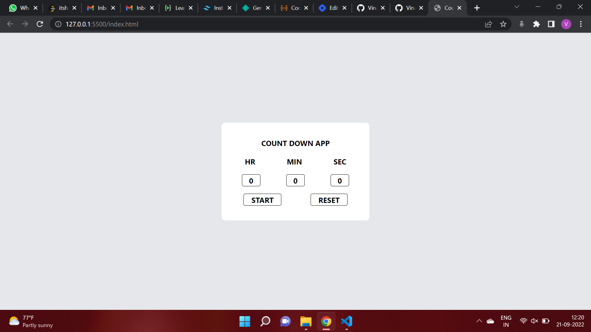

# **Countdown App using the Vanilla JS**
## **Overview**
This is a simple Countdown app through which we can set a timer and after hitting the start button, the timer will start and after reaching to zero a pop message will be displayed to the user. We can also stop reset the timer in between as we want.

## **Technology Used**
1. HTML
2. Tailwind CSS
3. JavaScript

## **Output**

## **Live Link**
